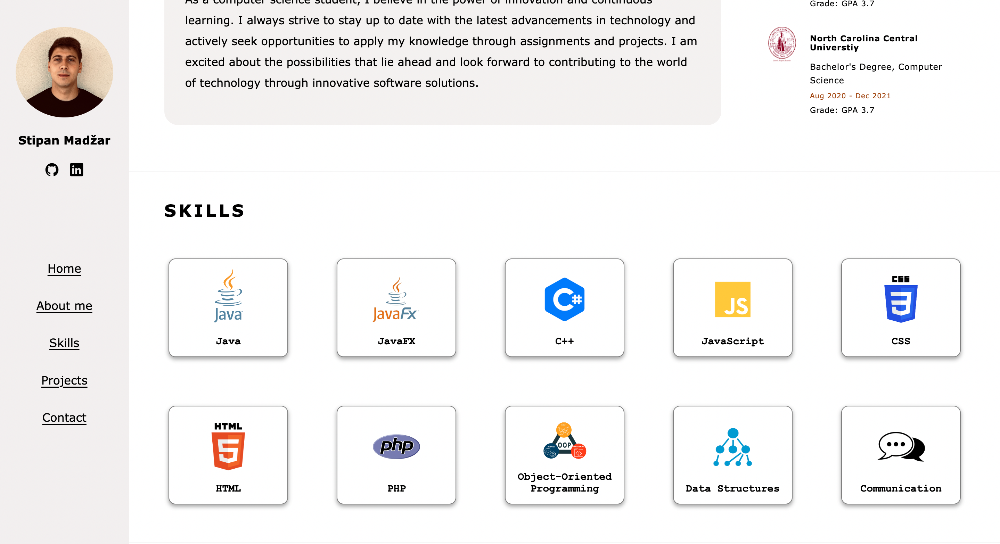
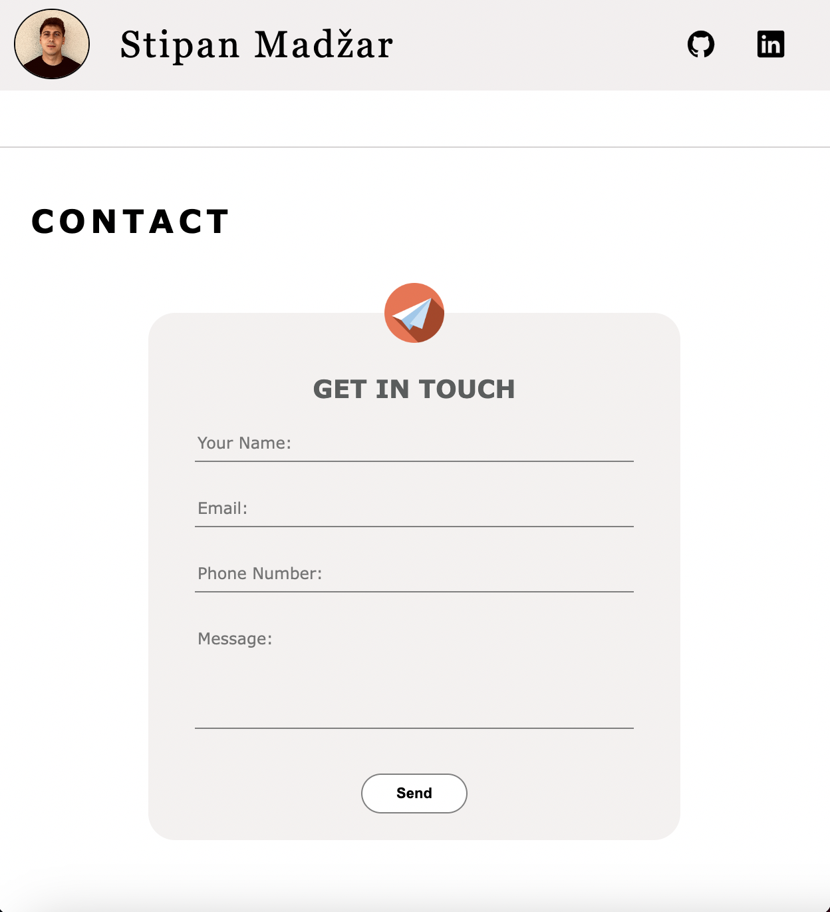

# Stipan Madžar - Portfolio

## 📄  Description

This is the personal portfolio website build in HTML, CSS, and JavaScript. This portfolio showcases my skills, projects, and contact information. 
It provides an overview of my background, education, and areas of expertise...

## 💻  Technologies

- HTML
- CSS
- JavaScript
- [Font Awesome](https://fontawesome.com/) (for icons)
- [EmailJS](https://www.emailjs.com/) (for contact form)

## 🌟  Features

- Responsive design for all screen sizes
- Detailed sections about background, education, projects and skills
- Contact form for users to get in touch
- Form validation
- EmailJS Integration
- Access to CV

## 🖼️  Screenshots

## 🔧  Installation

1. Clone this repository to your local machine using `git clone`.
2. Navigate to the project directory.
3. Open the `index.html` file in your web browser.

## 📞  Contact

- Stipan Madžar
- 📧 Email: smadzar90@student.se.edu
- 💼 GitHub: [https://github.com/smadzar90](https://github.com/smadzar90)
- 💬 LinkedIn: [https://www.linkedin.com/in/stipan-madzar-b6b857225/](https://www.linkedin.com/in/stipan-madzar-b6b857225/)
